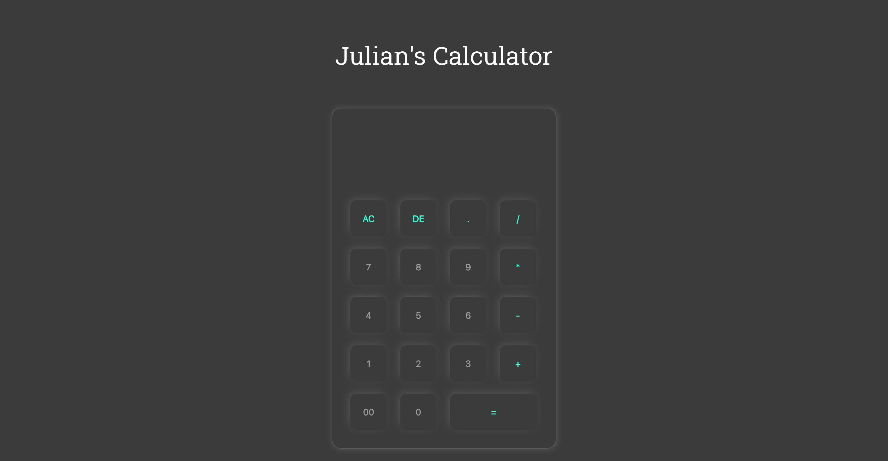

# JS-Calculator
## Description
Snow day here in Milwaukee, so I figured I'd use the time to finish this JS calculater and polish some of my JS skills! I was looking to toy around with using JS code in HTML files now that we've been dabbling more with that in class, and this seemed like a good project to try it out on.

## How to use
This app works just like a regular calculator. Click whichever numbers you plan to use, and select whichever binary operation to divide, multiply, subtract, or add. You can also clear the space using AC, or delete a singular number using DE. 

## Link
[Access the deployed project here](https://jtwiley1996.github.io/JS-Calculator/)

## Credits

For help on the code, I used various [Stack Overflow](https://www.stackoverflow.com) and [Youtube](https;//www.youtube.com) sources. Otherwise, I was originally going to style with bootstrap but ultimately decided against it. I also used [Roboto Slab](https://fonts.google.com/specimen/Roboto+Slab) as my primary font which I linked from Google. 

## Future Goals
In the future, I'd like to be able to make a more advanced calculator that features buttons comparable to the TI-84 that I had in high school. I'd also like to be able to make a more complex web page that accompanies the calculator with things like weather, news, etc.
